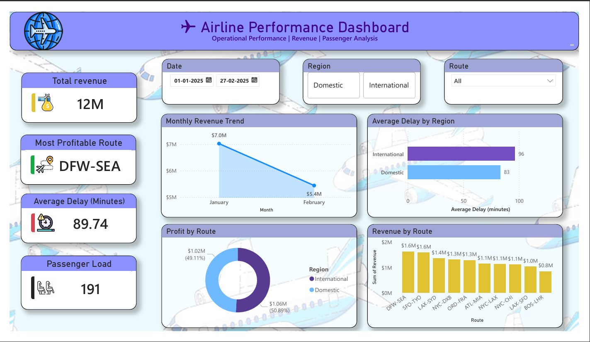
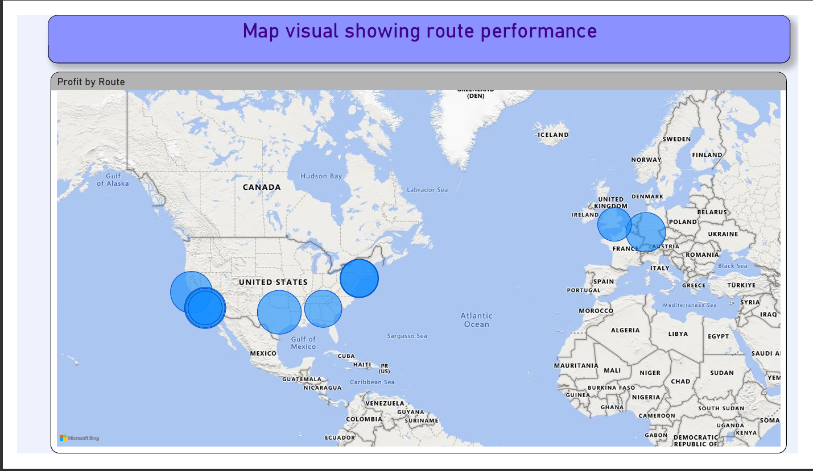

# ✈️ Airline Performance Dashboard – Power BI

## 📊 Project Overview

The **Airline Performance Dashboard** is an interactive Power BI dashboard built to analyze airline operational and financial performance.

The objective of this project is to help airline management quickly understand **revenue performance, flight delays, passenger load, and route profitability** and use these insights to support better operational and business decisions.

---

## 🎯 Business Objectives

The dashboard focuses on answering key business questions:

* How much revenue is the airline generating?
* What is the average flight delay?
* What is the average passenger load per flight?
* Which route is the most profitable?
* How is revenue changing over time?
* Which region experiences higher delays?
* Which routes contribute the most revenue?
* Where are opportunities to improve operational performance and profitability?

---

## 🛠️ Tools & Technologies

* **Power BI Desktop**
* **Power Query** – Data preparation and transformation
* **DAX** – KPI and analytical calculations
* **Data Visualization** – Interactive charts and KPI cards
* **CSV Dataset** – Airline operational data

---

# 📌 Dashboard KPIs

| KPI                       |                    Result |
| ------------------------- | ------------------------: |
| 💰 Total Revenue          |                  **$12M** |
| ⏱️ Average Delay          |         **89.74 minutes** |
| 👥 Average Passenger Load | **191 passengers/flight** |
| 🏆 Most Profitable Route  |               **DFW-SEA** |

The four KPIs were designed to provide management with a quick executive overview, as required by the assignment.

---

# 📈 Dashboard Visualizations

## 📊 Dashboard Preview

## 📊 Map Visual

### 1. Monthly Revenue Trend

The dashboard tracks revenue across the selected period to identify changes in financial performance.

* **January revenue:** approximately **$7.0M**
* **February revenue:** approximately **$5.4M**
* Revenue decreased by approximately **23%** from January to February.

This highlights the need to investigate the factors behind the decline, such as passenger demand, route performance, or operational disruptions.

---

### 2. Average Delay by Region

The regional comparison shows:

* **International:** 96 minutes average delay
* **Domestic:** 83 minutes average delay

International flights therefore experienced approximately **13 minutes more average delay** than domestic flights.

This makes international operations an important area for investigating delay-related inefficiencies.

---

### 3. Revenue by Route

The dashboard compares revenue generated across individual routes.

The highest-revenue routes include:

* **DFW-SEA:** ~$1.6M
* **SFO-TYO:** ~$1.6M
* **LAX-SYD:** ~$1.4M
* **NYC-DXB:** ~$1.3M
* **ORD-FRA:** ~$1.3M

The analysis shows that revenue is distributed across multiple major routes rather than being dependent on a single route.

---

### 4. Route Profitability

The dashboard identifies **DFW-SEA as the most profitable route**, making it an important route from a profitability perspective.

The profitability visual also shows a strong contribution from the leading routes, helping management identify routes that deserve closer attention when planning capacity and resources.

---

# 💡 Key Business Insights

### 1. Revenue performance needs monitoring

The airline generated approximately **$12M in total revenue**, but monthly revenue declined from around **$7.0M in January to $5.4M in February**.

**Business implication:** Management should investigate the reason for the decline before making decisions around route capacity or scheduling.

---

### 2. Flight delays are a major operational concern

The overall average delay is **89.74 minutes**, which is significant from a passenger-experience and operational-efficiency perspective.

International flights have a higher average delay (**96 minutes**) compared with domestic flights (**83 minutes**).

**Business implication:** International operations should be prioritized for delay analysis and process improvement.

---

### 3. Passenger utilization provides an important performance indicator

The average passenger load is **191 passengers per flight**.

**Business implication:** Passenger load should be analyzed alongside route profitability and revenue to determine whether high-revenue routes are also efficiently utilizing available capacity.

---

### 4. DFW-SEA is a key route

**DFW-SEA is identified as the most profitable route** in the dashboard.

**Business implication:** The airline should closely monitor this route and evaluate opportunities to maintain or increase its profitability through appropriate capacity, scheduling, and operational planning.

---

### 5. Revenue concentration is visible across major routes

Several routes contribute more than **$1M in revenue**, with DFW-SEA and SFO-TYO among the strongest revenue-generating routes.

**Business implication:** These high-performing routes can be monitored as priority routes while lower-performing routes can be evaluated for improvement opportunities.

---

# 🎯 Business Recommendations

### 1. Reduce International Flight Delays

Since international flights have a higher average delay than domestic flights, management should investigate the major causes of international delays.

Possible areas for operational review include:

* Airport turnaround time
* Ground handling
* Boarding processes
* Aircraft scheduling
* Connecting flight dependencies

---

### 2. Investigate the Monthly Revenue Decline

Revenue fell from approximately **$7.0M in January to $5.4M in February**.

Management should drill down into:

* Route-level revenue
* Passenger volumes
* Regional performance
* Flight frequency
* Passenger load

to identify the primary drivers of the decline.

---

### 3. Protect High-Performing Routes

Routes such as **DFW-SEA and SFO-TYO** generate strong revenue, while DFW-SEA is the most profitable route.

Management should monitor these routes closely and ensure that operational issues do not negatively affect their performance.

---

### 4. Optimize Capacity Using Passenger Load

With an average passenger load of **191 passengers per flight**, management can combine passenger-load data with route revenue and profitability to identify opportunities for better capacity allocation.

High-demand routes could potentially receive additional capacity, while consistently weaker routes could be reviewed for scheduling or capacity optimization.

---

### 5. Build a Regular Performance Monitoring Process

The dashboard can be used as an executive monitoring tool to track:

**Revenue → Passenger Load → Delays → Route Profitability**

Regular monitoring would allow management to identify performance changes early and take corrective action.

---

# 🚀 Skills Demonstrated

This project demonstrates practical skills in:

* Data Analysis
* Power BI Dashboard Development
* KPI Design
* Data Visualization
* Business Intelligence
* DAX
* Power Query
* Revenue Analysis
* Operational Performance Analysis
* Route Profitability Analysis
* Business Insight Generation
* Data-Driven Recommendations

---

# 🏁 Conclusion

The Airline Performance Dashboard provides management with a concise view of the airline's **financial and operational performance**.

The analysis highlights three major areas requiring attention:

**📉 Revenue decline →** Monthly revenue decreased from January to February
**⏱️ Operational efficiency →** Average delay is 89.74 minutes, with international flights performing worse
**✈️ Route performance →** DFW-SEA stands out as the most profitable route

By combining these indicators in a single dashboard, management can move from simply monitoring airline performance to making more **data-driven decisions around operations, capacity, and route strategy**.

---

## 📌 Project Type

**Power BI | Business Intelligence | Data Analytics | Airline Performance Analysis**
